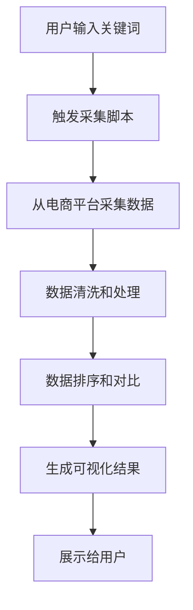

## 1. Product Overview
电商商品价格自动化采集与对比工具，帮助用户快速获取主流电商平台的商品价格信息并进行智能对比。
- 解决用户在多平台比价的繁琐问题，提供一站式价格监控和分析服务
- 目标用户为价格敏感的消费者和电商从业者，具有广阔的市场应用前景

## 2. Core Features

### 2.1 User Roles
| Role | Registration Method | Core Permissions |
|------|---------------------|------------------|
| General User | No registration required | Use all basic functions |

### 2.2 Feature Module
1. **Command Line Tool**:商品数据采集、数据处理、结果输出
2. **Web Interface**:关键词搜索、数据可视化、结果展示
3. **Data Processing**:数据清洗、去重、排序、对比分析

### 2.3 Page Details
| Page Name | Module Name | Feature description |
|-----------|-------------|---------------------|
| Web Interface | Search Module | 支持输入关键词进行商品搜索，触发采集脚本运行 |
| Web Interface | Results Module | 展示采集结果，包括商品列表、价格排序、横向对比 |
| Web Interface | Visualization Module | 提供价格趋势图表和性价比分析 |
| Command Line Tool | Collection Module | 从京东、淘宝、拼多多批量采集商品信息 |
| Command Line Tool | Processing Module | 清洗数据、去重、排序、生成对比报告 |

## 3. Core Process
用户通过命令行或网页界面输入关键词，系统调用采集模块从主流电商平台获取商品数据，经过数据处理后，以表格和图表形式展示结果，包括价格排序、横向对比和性价比分析。

## 4. User Interface Design
### 4.1 Design Style
- Primary colors: #3b82f6 (蓝色), #10b981 (绿色)
- Secondary colors: #f59e0b (橙色), #ef4444 (红色)
- Button style: Rounded corners, subtle shadows
- Font: Inter, system fonts
- Layout style: Card-based, clean and modern
- Icon style: Linear, minimalist

### 4.2 Page Design Overview
| Page Name | Module Name | UI Elements |
|-----------|-------------|-------------|
| Web Interface | Search Module | 搜索输入框、执行按钮、加载状态指示器 |
| Web Interface | Results Module | 商品卡片列表、排序选项、筛选功能 |
| Web Interface | Visualization Module | 价格趋势图表、性价比雷达图、数据表格 |

### 4.3 Responsiveness
- Desktop-first design with mobile adaptation
- Touch optimization for mobile devices
- Responsive layout that adjusts to different screen sizes

### 4.4 3D Scene Guidance
- Not applicable for this project