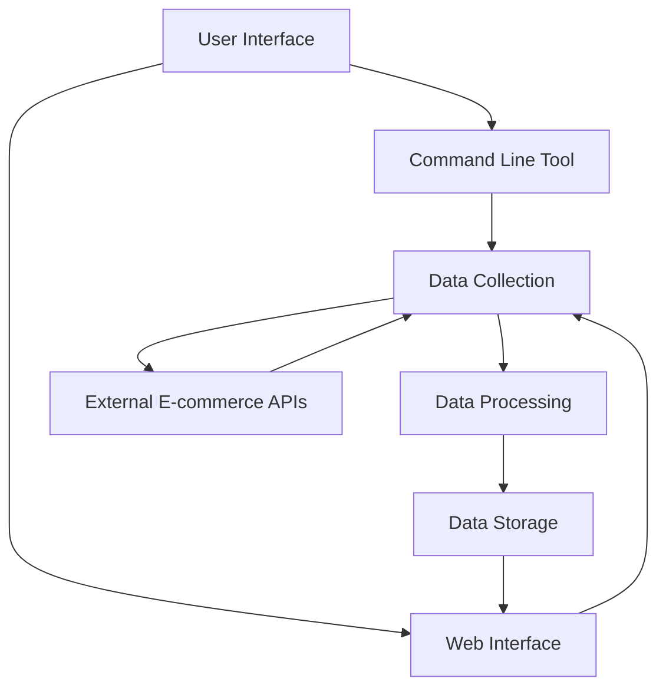
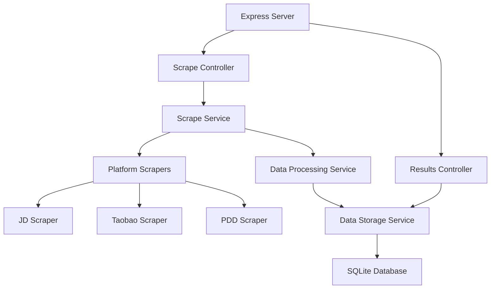
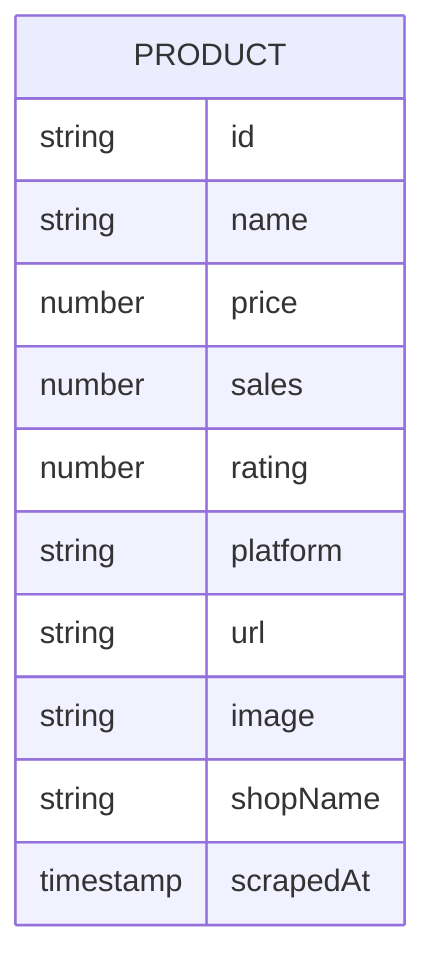

## 1. Architecture Design


## 2. Technology Description
- Frontend: React@18 + tailwindcss@3 + vite
- Initialization Tool: vite-init
- Backend: Node.js + Express@4
- Database: SQLite (for local storage)
- Data Visualization: Chart.js
- Web Scraping: Puppeteer
- HTTP Client: Axios

## 3. Route Definitions
| Route | Purpose |
|-------|---------|
| / | Web interface home page |
| /api/scrape | API endpoint for scraping e-commerce data |
| /api/results | API endpoint for retrieving processed results |

## 4. API Definitions
### 4.1 Scrape API
- **Endpoint**: POST /api/scrape
- **Request Body**:
  ```typescript
  interface ScrapeRequest {
    keyword: string;
    platforms: string[]; // ['jd', 'taobao', 'pdd']
    limit: number; // per platform
  }
  ```
- **Response**:
  ```typescript
  interface ScrapeResponse {
    success: boolean;
    data?: Product[];
    error?: string;
  }
  ```

### 4.2 Results API
- **Endpoint**: GET /api/results
- **Query Parameters**:
  - keyword: string
  - sortBy: string ("price", "sales", "rating")
- **Response**:
  ```typescript
  interface ResultsResponse {
    success: boolean;
    data: Product[];
    visualization: {
      priceTrend: number[];
      platformDistribution: { platform: string; count: number }[];
    };
  }
  ```

## 5. Server Architecture Diagram


## 6. Data Model
### 6.1 Data Model Definition


### 6.2 Data Definition Language
```sql
CREATE TABLE IF NOT EXISTS products (
    id TEXT PRIMARY KEY,
    name TEXT NOT NULL,
    price REAL NOT NULL,
    sales INTEGER,
    rating REAL,
    platform TEXT NOT NULL,
    url TEXT NOT NULL,
    image TEXT,
    shopName TEXT,
    scrapedAt TIMESTAMP DEFAULT CURRENT_TIMESTAMP
);

CREATE INDEX IF NOT EXISTS idx_products_platform ON products(platform);
CREATE INDEX IF NOT EXISTS idx_products_price ON products(price);
CREATE INDEX IF NOT EXISTS idx_products_scrapedAt ON products(scrapedAt);
```